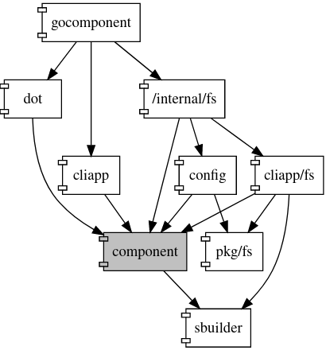
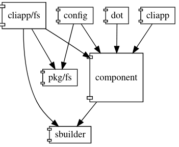
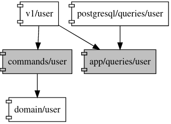
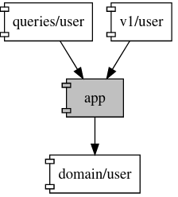

# Go component

Данный инструмент визуализирует компоненты и связи компонентов в проекте, написанном на go.

## Быстрый старт

Установка

```
go install github.com/ilya2049/gocomponent/cmd/gocomponent@latest
```

В корневой директории проекта (там, где находится `go.mod`) введите

```
gocomponent http --port 8080
```

Откройте в браузере `http://localhost:8080`


## Глоссарий

*Компонент (component)* - go-пакет в файловой системе, в котором есть go-файлы.

*Пользовательский компонент (custom component)* - любой go-пакет со вложенными пакетами, который выбрал пользователь. Пользовательским компонентом может быть также множество пакетов с одинаковым названием, которые не обязательно должны быть вложены друг в друга.

*Сторонний компонент (third party component)* - компонент, исходного кода которого нет в проекте. К сторонним компонентам относятся компоненты из стандартной библиотеки go и компоненты, перечисленные в файле `go.mod`.

*Граф компонентов* - граф, в котором вершиной является компонент, а ребром - наличие импорта (директива import в go-файле) между компонентами.

*Пространство имен (namespace)* - путь к компоненту в файловой системе от корневой директории проекта. Пространство имен однозначно определяет компонент.

```
Пространство имен (в пакете internal нет go-файлов, а в sbuilder есть):
/internal/sbuilder

Это тоже пространство имен:
/internal/

И это:
/internal
```

*Секция пространства имен (section)* - go-пакет в файловой системе. В контексте пространства имен - секция.

```
Секции пространства имен /internal/pkg/sbuilder:
internal
pkg
sbuilder
```

*Маркер-секция (marker-section)* - секция пространства имен, которая используется для создания пользовательского компонента, состоящего из множества пакетов с одинаковым именем.

*Идентификатор компонента (component id)* - одна или более секций из пространства имен, однозначно идентифицирующая компонент в некотором графе компонентов. Если идентификатор включает все секции пространства имен, то слева добавляется '/'. Идентификаторы компонентов вычисляет `gocomponent` автоматически.

```
Пусть есть следующие пространства имен:
/internal/fs
/internal/cliapp/fs
/internal/pkg/sbuilder

Тогда у этих компонентов будут следующие идентификаторы:
/internal/fs
cliapp/fs
sbuilder
```
## Конфигурация

Файл конфигурации должен называться `config.toml`. Формат конфигурации, соответственно, - toml. Конфигурационный файл должен находиться в директории, в которой запускается `gocomponent`.

Конфигурационные параметры

| Параметр                | Комментарий                                  |
|-------------------------|----------------------------------------------|
| project_directory       | Директория проекта с исходным кодом go. |
| include_third_party     | Включить в граф компонентов сторонние компоненты. |
| third_party_color       | Цвет сторонних компонентов. |
| enable_size             | Отобразить относительные размеры компонентов. |
| include_parents         | Включить в граф ребра, направленные из перечисленных компонентов. |
| include_children        | Включить в граф ребра, направленные в перечисленные компоненты. |
| exclude_parents         | Исключить из графа ребра, направленные из перечисленных компонентов. |
| exclude_children        | Исключить из графа ребра, направленные в перечисленные компоненты. |
| custom                  | Пользовательские компоненты. |
| only                    | Включить в граф ребра, соединяющие только перечисленные компоненты. |
| colors                  | Цвета компонентов. |
| extend_ids              | Регулярные выражения, позволяющие расширить идентификаторы компонентов. |

Если запустить `gocomponent` в директории без файла конфигурации, то будет использована конфигурация по умолчанию, в которой задан только один параметр `project_directory=./`. То есть в качестве проекта указана текущая директория.

## Команды утилиты gocomponent

Запустить http-сервер. Опция `--port` опциональна. По умолчанию используется порт `8080`.

```
gocomponent http --port=8080
```

Напечатать идентификаторы компонентов и соответствующие им пространства имен

``` sh
gocomponent ns
```

Напечатать граф компонентов на языке dot

``` sh
gocomponent dot

# Записать в файл
gocomponent dot > graph.dot
```

Сохранить граф в формате svg

``` sh
gocomponent svg

# Записать в файл
gocomponent svg > graph.svg
```

## Примеры

Все примеры структурированы следующим образом:
- текстовое описание (если требуется)
- конфигурация
- граф компонентов, соответствующий конфигурации

### Какими компонентами импортируется данный компонент?

``` 
project_directory = '/path/to/project'

include_children = [
    '/internal/component'
]
```


### Какие компоненты импортирует данный компонент?

``` 
project_directory = '/path/to/project'

include_parents = [
    '/internal/config'
]
```


### Какие сторонние компоненты импортирует данный компонент?

Текущая версия `gocomponent` не может отобразить исключительно сторонние компоненты - в графе компонентов присутствуют все импортируемые компоненты. Поэтому сторонние компоненты выделены оранжевым цветом.

``` 
project_directory = '/path/to/project'

include_third_party = true
third_party_color = 'orange'

include_parents = [
    '/internal/config'
]
```


### Исключение компонента

```
project_directory = '/path/to/project'

exclude_parents = [
    '/internal/component'
]

exclude_children = [
    '/internal/component'
]
```




### Расширение идентификатора компонента

Часто случается так, что идентификатор компонента, вычисленный автоматически, малоинформативен. Есть возможность указать количество дополнительных секций, которые добавятся к идентификатору. В примере ниже в идентификатор компонента 'v2' добавляется одна дополнительная секция. Здесь 'v\d+$' - это регулярное выражение, которое разбирается с помощью пакета 'regexp'.

```
project_directory = '/path/to/project'

include_third_party = true
third_party_color = 'orange'

[extend_ids]
'v\d+$' = 1
```


### Пространство имен в качестве идентификатора компонента

Вычисленные автоматически идентификаторы компонентов могут быть неинформативны. В этом случае можно использовать пространства имен в качестве идентификаторов. Для этого достаточно указать отрицательное или равное нулю число секций для расширения идентификатора.

```
project_directory = '/path/to/project'

[extend_ids]
'./' = -1
```


### Относительный размер компонентов

Размер компонентов определяется суммой байтов исходного кода в go-файлах компонента. Относительные размеры получаются с помощью минимаксной нормализации.

```
project_directory = '/path/to/project'

enable_size = true
```



### Пользовательский компонент

Пусть в некотором проекте помимо прочих есть следующие пространства имен:
```
...
/internal/app/commands/user
/internal/app/queries/user 
...
```
Пользовательский компонент объединяет в себе все вложенные в него компоненты: 'commands/user' и 'queries/user'.

```
project_directory = '/path/to/project'

custom = [
    '/internal/app'
]

[colors]
'/internal/app' = 'gray'
```




### Пользовательский компонент из маркер-секции

Чтобы объединить в пользовательский компонент пакеты, в пространствах имен которых есть определенная секция, достаточно в конфигурационном списке `custom` указать эту секцию.

```
project_directory = '/path/to/project'

custom = [
    'user'
]

[colors]
'user' = 'gray'
```


### Как связаны между собой слои приложения?

Допустим, в приложении три основных слоя: domain, app и infra. Все .go-файлы располагаются в соответствующих пакетах. В граф компонентов включаются только соответствующе пространства имен (only). Все go-файлы в слоях объединяются в пользовательские компоненты (custom).

``` 
project_directory = '/path/to/project'

only = [
    '/internal/app',
    '/internal/domain',
    '/internal/infra'
]

custom = [
    '/internal/app',
    '/internal/domain',
    '/internal/infra'
]
```


### Какие сторонние компоненты импортирует слой приложения domain?

``` 
project_directory = '/path/to/project'

include_third_party = true
third_party_color = 'orange'

include_parents = [
    '/internal/domain'
]

custom = [
    '/internal/domain'
]
```

