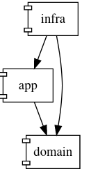

# Go component

Данный инструмент визуализирует компоненты и связи компонентов в проекте, написанном на go.

## Быстрый старт

Установка

```
go install github.com/ilya2049/gocomponent/cmd/gocomponent
```

В корневой директории проекта (там, где находится `go.mod`) введите

```
gocomponent http --port 8080
```

Откройте в браузере `http://localhost:8080`


## Глоссарий

*Компонент* - go-пакет в файловой системе.

*Пространство имен* - путь к компоненту в файловой системе от корневой директории проекта. Пространство имен однозначно определяет компонент.

```
# Пространство имен
/internal/pkg/sbuilder
```

*Секция пространства имен* - go-пакет в файловой системе. В контексте пространства имен - секция.

```
# секции пространства имен /internal/pkg/sbuilder
internal
pkg
sbuilder
```

*Идентификатор компонента* - одна или более секций из пространства имен, однозначно идентифицирующая компонент. Если идентификатор включает все секции пространства имен, то слева добавляется '/'. 

```
# Пространства имен
/internal/fs
/internal/cliapp/fs
/internal/pkg/sbuilder

# Идентификаторы компонентов
/internal/fs
cliapp/fs
sbuilder
```

## Примеры

Все примеры структурированы следующим образом:
- конфигурация
- граф компонентов, соответствующий конфигурации

### Какими компонентами импортируется данный компонент?

``` 
project_directory = '/path/to/project'

include_children = [
    '/internal/component'
]
```


### Какие компоненты импортирует данный компонент?

``` 
project_directory = '/path/to/project'

include_parents = [
    '/internal/config'
]
```


### Какие сторонние компоненты импортирует данный компонент?

Текущая версия `gocomponent` не может отобразить исключительно сторонние компоненты - в графе компонентов присутствуют все импортируемые компоненты. Поэтому сторонние компоненты выделены оранжевым цветом.

``` 
project_directory = '/path/to/project'

include_third_party = true
third_party_color = 'orange'

include_parents = [
    '/internal/config'
]
```


### Как связаны между собой слои приложения?

Допустим, в приложении три основных слоя: domain, app и infra. Все .go-файлы располагаются в соответствующих пакетах. В граф компонентов включаются только соответствующе пространства имен (include_parents, include_children). Все .go-файлы в слоях объединяются в пользовательские компоненты (custom). Чтобы сравнить объем исходного кода в слоях приложения, активирована настройка enable_size.

``` 
project_directory = '/path/to/project'

enable_size = true

include_parents = [
    '/internal/app',
    '/internal/domain',
    '/internal/infra'
]

include_children = [
    '/internal/app',
    '/internal/domain',
    '/internal/infra'
]

custom = [
    '/internal/app',
    '/internal/domain',
    '/internal/infra'
]
```

